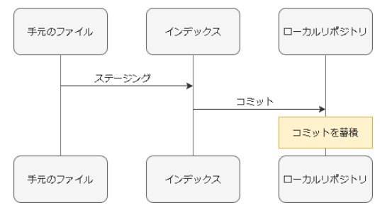
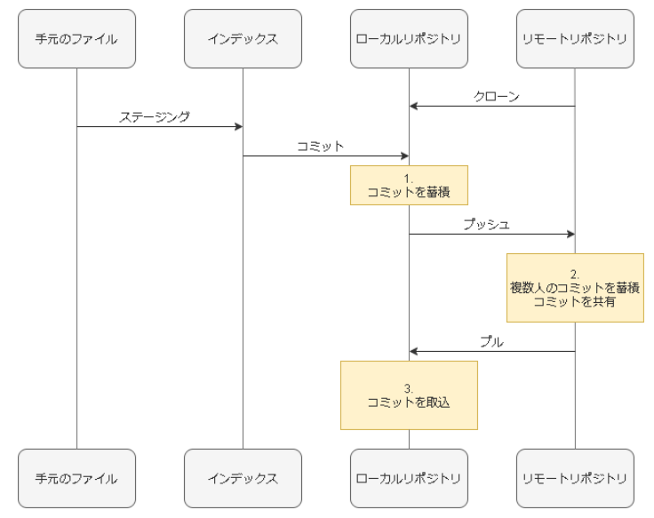
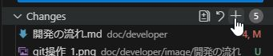
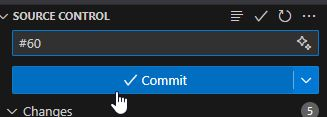

# 開発の流れ
## GitとGitLabの概要

最低限のGit操作や説明を以下に記載しますが、Gitはいろいろな機能や使い方があり、Gitの仕組みについてもここでは解説できるレベルのものではないです。  
基本的に実際に触って習うよりも慣れろで身に付けていく技術なため、困ったことがあったら都度調べて対応するようにしてください。

## 環境の構成図

検証環境の同一サブネットにGitLabと開発環境を作成しています。

### Gitの基本的な概念・キーワード

**Git**  
分散型バージョン管理システムです。
コードやファイルの更新履歴を記録していき、過去の状態を確認したり、最新の状態との差分を見たりできます。

**リポジトリ**  
* ファイルが置かれている場所
* 実態は各ブランチのコミットを積み重ねたもの
* ローカルリポジトリ
  * 自分のマシン上でファイルやディレクトリの状態を記録する場所
  * PushやPullを行うことでリモートリポジトリと同期させる
* リモートリポジトリ
  * 共有サーバ上でファイルやディレクトリの状態を記録する場所

**コミット**  
* 変更内容のスナップショット
* すべてのコミットは1つの親コミットを持っており、現在のコミットから過去のコミットをすべて積み重ねたものが現在のファイルとして見えている
    * 特定のコミットから子コミットを複数作成することは可能だが、1つのコミットが親コミットを2つ以上持つことはない
    * 例外として、リポジトリ作成時の最初のコミットのみ親コミットを持っていない
* コミットごとに一意のハッシュ値が振られ、任意のコミットから新しくコミットを作成できる
* 特定のコミットのハッシュ値に任意の名前（タグ）を付けることもでき、タグを付けることで参照がしやすくなる
    * リリースのバージョン管理で使われることが多い

**ブランチ**  
* 連続したコミットの最新コミットへのポインタ
* コミットは複数に分岐させることができ、それぞれの分岐先の最新のコミットのハッシュ値に任意の名前を付けたものがブランチ
* リポジトリ作成時には必ずmainブランチが存在する

**マージ**  
* 分岐したブランチを他のブランチに合流させる操作のこと
* ブランチを増やしてmainへマージしていくのが基本的な開発のフロー
* どのようにブランチを増やして開発してマージしていくのかを考えた一連の流れものをブランチ戦略という
    * 有名なブランチ戦略に「Git Flow」や「GitHub Flow」と呼ばれるものがある

**マージリクエスト（MR）**  
* ブランチをマージする際、変更点のレビューやコメントでのやりとりをできるGitLabに用意された仕組み
* GitHubではプルリクエストと呼ばれている操作と同じ

**コンフリクト**  
* 異なるブランチで同じファイルを変更し、一方をマージしたあとにもう一方をマージする等で変更内容に競合が発生してマージできなくなる状態のこと
* これが発生した場合は内容にもよって解決方法は異なるが、後からマージしたいブランチに最新の状態をマージしてからPushするのが基本的な解決方法

## Git操作
* ローカルリポジトリでの操作  
  
  * add（ステージング）  
  ファイルやディレクトリを変更した後、コミットの対象とするファイルやディレクトリを登録しておくものをインデックスと呼び、インデックスに登録する操作をステージングと呼ぶ。  
  インデックスに登録されていないファイルやディレクトリはコミットされないため、コミットを行う前にはステージングを行う必要がある。
  * commit  
  ファイルやディレクトリの追加・変更をリポジトリに記録する操作。commitを行うと、ローカルリポジトリの現在のブランチに前回コミットから現在までの差分が新しいコミットとして記録される。  

* リモート - ローカルリポジトリ間の操作  
  
  * clone  
  ローカルにリモートリポジトリを複製する（ローカルリポジトリを作成する）操作。リモートリポジトリのすべてのコミットがローカルに複製される。cloneしたリモートリポジトリには`origin`という識別子が付けられる。
  * switch  
  ローカルでカレントブランチの切り替えを行う操作。
  * fetch  
  ローカルにリモートリポジトリのコミットの取得だけを行う操作。
  * pull  
  ローカルブランチにリモートブランチをマージする操作。ローカルでファイルを変更していたりコミットをしていた場合はコンフリクトが発生する。ローカルのmainブランチを最新化する際に使用する使い方がおそらくもっとも多い。
  * push  
  ローカルリポジトリで作成・変更したブランチをリモートリポジトリへアップロードする操作。

## GitLabとは

Gitを使ってコード管理を行えるサービスです。  
リモートリポジトリ機能のほか、ユーザ管理、タスク管理、CI等の機能も備わっています。  
Git単体でもリモートリポジトリを作成してコード管理することはできますが、GitLabのようなホスティングサービスを利用することで、より便利で簡単にGitを扱うことができます。  
類似のサービスにGitHubがあり、どちらのサービスを利用してもそれほど違いはありませんが、GitLabにはローカル環境で動かせるいわゆるオンプレ版も提供されているのが大きな違いになります。  
クラウドのサービスでも公開設定や権限設定などは行えるため十分セキュアな運用は可能ですが、ネットワークやポリシー的に不可な場合でもオンプレ版を利用すれば内部のネットワーク内で稼働させてよりセキュアな運用が可能になります。

## Issue対応の流れ

コード開発は事前にGitLabのIssueに対応する内容を起票しておき、Issueに担当者を割り当ててブランチを作成して対応を行い、対応したブランチをマージすることで行っていきます。  
このようなブランチを使った開発の流れをブランチ戦略と呼び、具体的なやり方として有名なものには`Git Flow`や`GitHub Flow`（GitLabを使っている場合でも名称としては`GitHub Flow`）などがあります。  
ブランチ戦略にはさまざまな方法が提案されていますが、細かい定義や手順にこだわらずに自分たちがやりやすい方式を決めて運用していくのがよいです。  
どのような場合でも、大まかにはメインのブランチからIssue対応用のブランチを作成し、対応が完了したらIssue対応用のブランチをメインのブランチにマージするといった流れになります。

以下はIssueを起票した状態からIssue対応を行っていく具体的な流れの一例になります。

### 準備

Issue対応前に対応者ごとに開発環境でリポジトリをクローンします。  
一度クローンすれば以降の対応ではクローンは不要です。  
クローンの際にGitLabの認証情報が聞かれます。

* リポジトリをクローン  
`git clone <リポジトリURL>`  
`cd <リポジトリ名>`
* Git認証情報を登録  
`git config user.name "<GitLabに登録したユーザ名>"`  
`git config user.email "<GitLabに登録したメールアドレス>"`  
* 確認  
`git remote -v`  
`git config --list | grep ^user`

### issue対応の流れ

FetchやPush等のリモートリポジトリとのやりとりを行うコマンドを実行した際にGitLabの認証情報が聞かれます。  
Pushを行うまではローカルで変更した内容はローカルでのみ変更されている状態です。  
なお、ローカルでブランチを作成してからPushする方法もありますが、ここでは先にリモートリポジトリにブランチを作成する方法で記載します。

* 対応するIssueのリモートブランチとMRのDraftを作成  
  * Issueページにて「マージリクエスト作成」ボタンを押す

* 空のリモートブランチを開発環境に取得する（git fetch）  
`git fetch`  

* 取得した空のローカルブランチにカレントブランチを変更する  
`git switch <作成したブランチ名>`  

* Issue対応を行う  
ファイル更新したりコードの動作確認を行ったりして対応します。

* コミットするファイルを登録する（git add）  
`git add <ファイル名>`  
※カレントディレクトリ以下のすべてのファイルを登録する場合：`git add .`

* 登録したファイルでコミットを作成する（git commit）  
`git commit -m "適当なコミットメッセージ"`

* リモートブランチへコミットを反映させる（git push）  
`git push origin <ブランチ名>`

* MRのDraftを解除する  
Gitlabの該当MRページ>概要タブにて「MarkAsReady」を押す

* レビュー依頼  
修正必要な場合は、Issue対応～Pushを再度実施する。
マージされたら該当MRとIssueが自動でCloseされてIssue対応完了。

### レビュアーのやること

申請されたMRのブランチをマージして問題ないか確認し、問題なければマージを行います。  
レビュアーはIssue対応者とは別の人が行う方が望ましいですが、同じ人が自己レビューのみでマージしても問題はありません。

* 変更内容を確認  
Gitlabの該当MRページ>変更タブにて、差分を確認する  
指摘事項があれば指摘箇所の行にコメントをつける等を行う
* マージ  
Gitlabの該当MRページ>概要タブ>マージボタンを押す  

### 補足

* よくある込み入ったシチュエーションでの操作方法は[こちら](https://github.com/cnc4e/git-practice/blob/master/README.md#3-%E7%89%B9%E5%AE%9A%E3%82%B7%E3%83%81%E3%83%A5%E3%82%A8%E3%83%BC%E3%82%B7%E3%83%A7%E3%83%B3%E3%81%A7%E3%81%AE%E6%93%8D%E4%BD%9C)  
* gitコマンドはVSCodeのGUIでも実行できます。  
コマンドでもGUI操作でもやっていることは同じなので、やりやすい方法で操作してください。
  * add  
    
  * commit  
    

ただし、最初はコマンドでの操作に慣れておいた方が一連の流れを覚えやすいかと思います。
