# AWS環境でECSを用いたWebシステムのTerraformチュートリアル

## 概要

このチュートリアルでは、AWSのECS（Elastic Container Service）を使用してWebシステムを構築する手順を、Terraformを活用して学びます。  
AWSやコンテナ技術、Infrastructure as Code（IaC）が初心者の方を対象にしており、Terraformでモジュール化された構成でシステムを実装することを目指します。初心者でも安心して取り組めるよう、具体的な手順やポイントを順を追って説明します。

## 目的

このチュートリアルの最終的な目標は、AWSのリソース管理をTerraformを使って実施できるようになることです。  
とくに、AWS環境における基礎的なアーキテクチャの理解を深めると同時に、Terraformのモジュールを活用して再利用性の高いコードを実装することができるようになることが目標です。

## アーキテクチャ

本チュートリアルで構築するシステムのアーキテクチャは、AWSの標準的な設計に基づいています。まず、VPCを中心にネットワークを構成し、その中に複数のサブネットを配置します。また、セキュリティグループやルートテーブルを設定し、インターネットゲートウェイを通じて外部通信ができるようにします。続いて、ECSクラスターを設定し、その上で動作するコンテナ化されたアプリケーションをデプロイします。

今回のチュートリアルでは、ネットワーク構成の構築に重点を置き、インフラの基盤部分を完成させます。ECS上のアプリケーションデプロイやオートスケーリングなどの高度な機能については、次のステップで詳しく取り扱います。

## 目次

1. [事前準備](./step01.md)
1. [認証情報をローカルに設定](./step02.md)
1. [Terraformコードのモジュール化について](./step03.md)
1. [Terraformの状態管理用S3バケットの作成](./step04.md)
1. [VPCの作成](./step05.md)
1. [Terraformの変数の共通化](./step06.md)
1. [リソースの命名規則やNAMEタグの追加について](./step07.md)
1. [モジュール間で変数を共有する](./step08.md)
1. [VPCの再作成および確認](./step09.md)

---

- [次のページに進む](step01.md)
