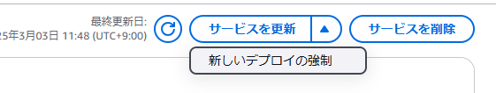

# ECSのトラブルシューティング方法
このページでは、ECSのトラブルシューティング方法について説明します。  
コンテナでトラブルが発生した際はコンテナの内部状態を確認することが多く、ECSの場合も稼働しているコンテナに接続して内部状態を確認する作業を行います。    
一般的にコンテナへ接続するためには稼働しているインスタンスやサーバからDocker等のツールのコマンドを使って接続しますが、ECSはFargateを使って動かすことが多く、その場合はインスタンスからの接続ということができません。    
そこで、ここでは2つの方法を紹介します。  
基本的には1.を、1.が不可な場合は2.を推奨します。

1. ECS Execコマンド(AWSCLI)を利用する  
2. EC2インスタンスに接続し、dockerコマンドでコンテナに接続する   


## ECS Execコマンドを利用する
ECSのコンテナへはAWS CLIを使って接続することが可能です。  
この方法では、十分に権限のある環境からであればFargateで稼働させているコンテナへの直接接続が可能です。  
ただし、ECSに接続のための権限や設定を行う必要があるため、事前に設計上問題ないかどうかの確認をしてください。  
不可な場合は、後半に挙げるコンテナを一時的にEC2インスタンスで稼働させる方法でトラブルシューティングを行ってください。  

* 参考：[公式ドキュメント](https://docs.aws.amazon.com/ja_jp/AmazonECS/latest/developerguide/ecs-exec.html)  

### 前提条件
* AWS CLIがバージョン2.x以上であること。
* 使用するIAMロールにecs:ExecuteCommand権限が付与されていること。
* ECSタスク定義で`enableExecuteCommand`が有効になっていること。
* ECS Agentのバージョンが1.50.0以上であること。  

### 手順

1. 該当サービスのタスクロールに以下ポリシーをアタッチします。  
```
{
    "Version": "2012-10-17",
    "Statement": [
        {
            "Effect": "Allow",
            "Action": [
                "ssmmessages:CreateControlChannel",
                "ssmmessages:CreateDataChannel",
                "ssmmessages:OpenControlChannel",
                "ssmmessages:OpenDataChannel"
            ],
            "Resource": "*"
        }
    ]
}
```

2. AWS CLIにて、該当サービスのecs execを有効化します。
```
# 有効化
$ aws ecs update-service \
--region <リージョン名> \
--cluster <クラスタ名> \
--services <サービス名> \
--enable-execute-command

# 確認
$ aws ecs describe-services \
--region <リージョン名> \
--cluster <クラスタ名> \
--services <サービス名> | jq '.services[].enableExecuteCommand'
```

3. マネコン>ECS>該当サービスにて、サービスを更新します。 
  


4. AWS CLIにて、ecs execコマンドを実行します。  
```
$ aws ecs execute-command \
    --cluster <クラスタ名> \
    --task <タスクID> \
    --container <コンテナ名> \
    --command "/bin/sh" \
    --interactive
```

5. ログインできました。コンテナ内部の状況を確認します。  
コンテナはsystemdを持っていないので、systemctlコマンドでの確認はできません。    
以下は、コンテナ内でNginxサービスが起動していることを確認する例です。  

```
The Session Manager plugin was installed successfully. Use the AWS CLI to start a session.


Starting session with SessionId: ecs-execute-command-cc79nv9us8zq7sne5lxrekg9hy
/ # 
/ # 
/ # systemctl status nginx.service
/bin/sh: systemctl: not found
/ # 
/ # curl localhost
<!DOCTYPE html>
<html>
<head>
<title>Welcome to nginx!</title>
<style>
html { color-scheme: light dark; }
body { width: 35em; margin: 0 auto;
font-family: Tahoma, Verdana, Arial, sans-serif; }
</style>
</head>
<body>
<h1>Welcome to nginx!</h1>
<p>If you see this page, the nginx web server is successfully installed and
working. Further configuration is required.</p>

<p>For online documentation and support please refer to
<a href="http://nginx.org/">nginx.org</a>.<br/>
Commercial support is available at
<a href="http://nginx.com/">nginx.com</a>.</p>

<p><em>Thank you for using nginx.</em></p>
</body>
</html>
/ # 
/ # 
```


## EC2インスタンスに接続し、コンテナに接続する
ECSのコンテナは通常のEC2インスタンスで動かすことが可能です。  
そこで、トラブルシューティング用として一時的にEC2インスタンスで稼働させ、インスタンスからコンテナのトラブルシューティングを行う方法を記載します。  

### 前提条件
* ECSのインフラストラクチャがEC2であること。  
* EC2インスタンスに接続可能であること。(セキュリティグループ、SSHキー、SSM設定等が必要)    
### 手順
1. SSHまたはSSMによりEC2インスタンスに接続します。  
```
$ ssh -i <鍵ファイル> ec2-user@<EC2のIPアドレス>
```
2. 実行中のコンテナ一覧を確認します。  
以下コマンドで、コンテナID、名前、ステータスなどが一覧表示されます。
```
$ docker ps
```

3. 必要に応じてフィルタリングして確認対象のコンテナIDを絞り込むことができます。   
例えば、イメージ名でフィルタリングする場合:  
```
$ docker ps --filter "ancestor=<イメージ名>"
```

4. Dockerコマンドを使用して、対象のコンテナに接続します。　    
```
$ docker exec -it <コンテナ名またはコンテナID> /bin/bash
```
    
5. ログインできました。ECS Execコマンドでログインした場合と同様に、コンテナ内で状況確認します。  
```
# 
# curl localhost
（略）
```